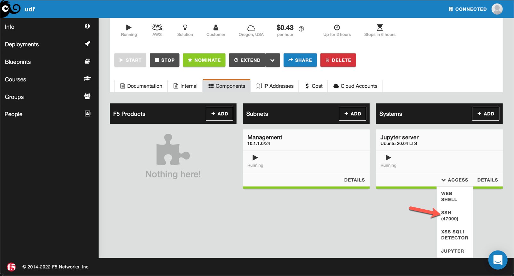

Lab 2
=======

`Last updated: 2022-04-11 3:00 PM EST`

Serve the model
-----------------

Now we can use our pre-trained model to perform predictions (inferences) on the input text. We will extract HTTP path from the incoming HTTP request and "feed" it into the model to determine if HTTP path contains XSS or SQLi attacks.
`detectorv2.py` is the script that acts as a simple HTTP proxy while performing predictions and mitigation of XSS/SQLi attacks. Script takes few arguments:

 - `--port`  - port to listen on for HTTP requests
 - `--origin` - origin server to proxy requests to
 - `--host` - value of "Host" header to use for origin server
 - `--ip` - IP address to listen on for HTTP requests 
 - `--proto` - origin server protocol i.e. http or https 
 - `--model` - ML predictor to use

1. Connect to SSH terminal

2. Run the `detectorv2.py` script  

.. code-block:: terminal

    sudo su - jupyter
    cd ~/Jupyter/notebook/ml_sqli_detector
    python3 detectorv2.py --ip 10.1.1.4 --port 8081 --proto https

.. note:: By default script will proxy HTTP requests to `https://arcadia.f5ase.net` and use the same host header.

3. Connect a second SSH terminal and use XSStrike to simulate XSS traffic:

    .. code-block:: terminal

        cd ~/XSStrike
        python3 xsstrike.py -u "http://10.1.1.4:8081/index.php?prod=" --crawl --fuzzer

4. Use DSSS to simulate SQLi traffic:

    .. code-block:: terminal

        cd ~/DSSS
        python3 dsss.py -u "http://10.1.1.4:8081/?product=shirt"

5. Browse `Arcadia Web App` using web browser: 

     - Ensure `detectorv2.py` is running
     - Navigate to `XSS SQLI DETECTOR` in UDF ( Jupyter server VM )

    .. image:: static/detector.png

.. note:: There will be some false positives which is expected based on the amount of training data available. Real world models are constantly fine-tuned and re-trained periodically ( or at real - time, depending on whether it's supervised or unsupervised learning)

END OF LAB
